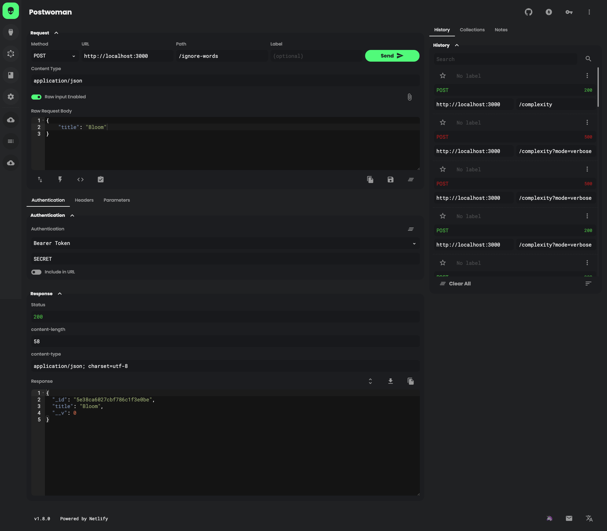

# Lexical density counter

## Requirements

- Node v12.14.0
- MongoDB 4.2

## Step 1: Install & setup

1. Clone repo
```bash
git clone git@github.com:joynal/lexical-density-counter.git
cd lexical-density-counter
```

2. Install npm packages:
```bash
npm i
```

3. Setup environment variables
Copy .env.example to .env and replace .env configurations.

4. Seed non lexical words
```
node src/api/seed/run.js
```

## Step 2: Start server
```
npm run start
```

### API's

1. `/complexity` or `/complexity?mode=verbose` POST route takes `"text"` as input field


Following routes are protected with app secret and pass app secret as a authorization token.

2. `/ignore-words` POST route take `"title"` as input filed, and add word to the db
3. `/ignore-words/:id` remove route, removed word from db

### Screenshots

<p align="center">
  
</p>


## License

This project is licensed under the MIT License - see the [license.md](./license.md) file for details
